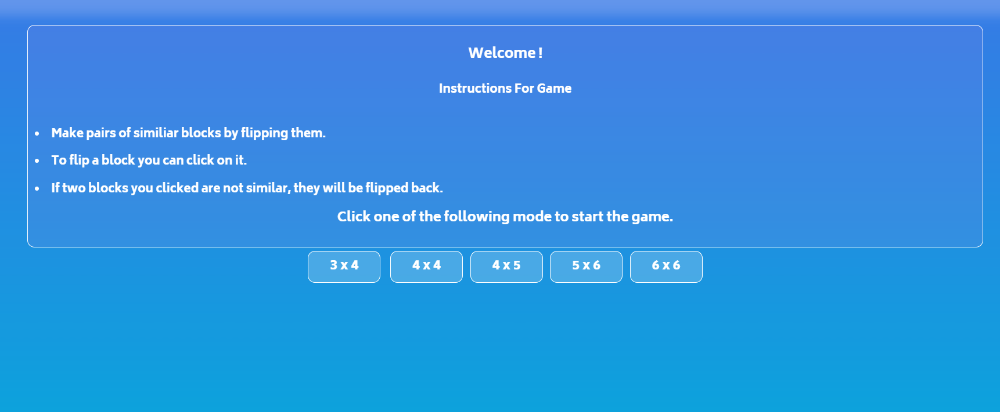
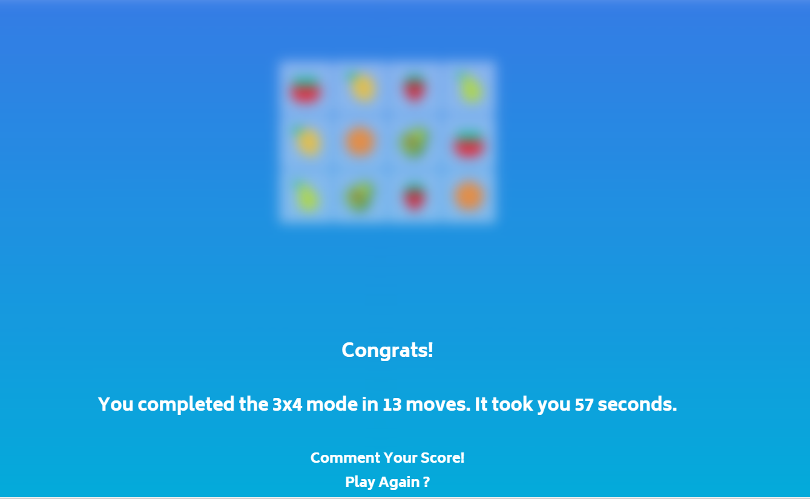
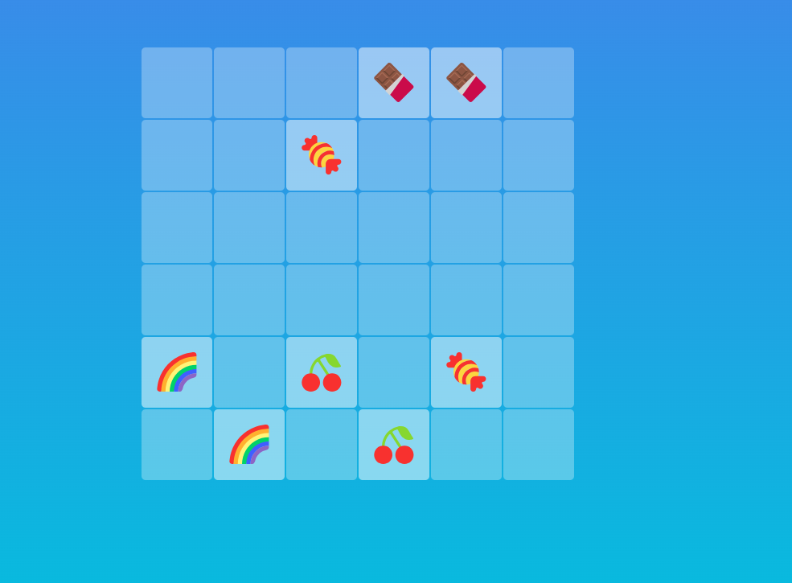

# Twin_Tasker.github.io

Twin Tasker is a captivating memory matching game where players uncover pairs of hidden cards to challenge and enhance their cognitive skills. This game have certain levels to test your memory prowess as you flip cards, aiming to reveal matching pairs and explore patterns within.
This project is made using HTML,CSS &amp; JavaScript.

 
Here are some snapshots from game.

 

